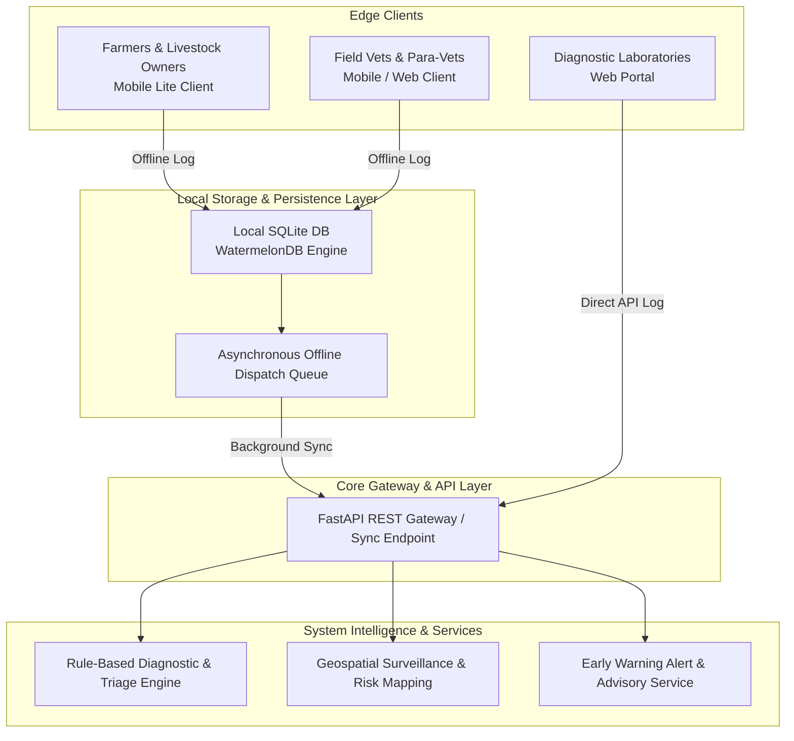
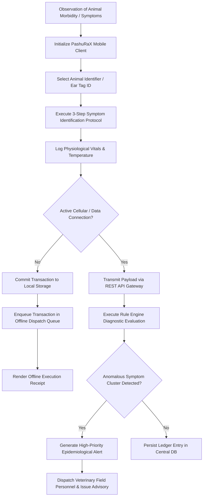

# PashuRaX: A Low-Resource, Offline-First Digital Architecture for Livestock Health Surveillance and Early Warning Systems

**Author Specification:** System Architecture & Development Team
**System Specification:** Version 1.0 (September 2026)
**Target Platform:** Mobile-Edge Devices, Entry-Level Smartphones, and Low-Bandwidth Infrastructure

---

## Abstract & System Overview

Livestock disease outbreaks pose significant threats to global food security, agricultural economies, and rural livelihoods. Conventional surveillance systems often suffer from delayed reporting, fragmented records, and poor connectivity in remote agrarian regions. This paper presents **PashuRaX**, a digital infrastructure engineered for continuous livestock health surveillance and early disease detection. Operating on an offline-first, low-overhead mobile framework, PashuRaX enables rapid incident reporting, automated rule-based risk evaluation, and seamless multi-tiered escalation across farmers, field veterinarians, laboratories, and governmental authorities. The architecture minimizes computational and network resource consumption, making it operable on entry-level smartphones in constrained environments.

---

## Releases & Downloadable Installation Packages

| Release Version | Package Name | Specification | Direct Download Link |
| :--- | :--- | :--- | :--- |
| **v1.0 (Latest)** | `PashuRaX_v1.0` | Standalone Parsed & Packed Standalone Application (Offline-First Production Build) | [Download PashuRaX_v1.0 Application Package](https://github.com/PashuRaX/releases/download/v1.0/PashuRaX_v1.0.apk) |

---

## 1. Introduction & Detailed System Description

The Livestock Health Surveillance and Early Warning System (PashuRaX) provides a digital mechanism for collecting, managing, and analyzing animal health metrics across administrative levels.

Traditional livestock health management is primarily reactive, leading to containment delays during infectious disease events. PashuRaX addresses these systemic challenges by providing:
1. **Unified Health Ledgering:** Standardized digital records for individual animals and herds.
2. **Offline Data Capture:** Asynchronous transaction logging on local SQLite storage, synchronizing automatically upon network restoration.
3. **Multi-Stakeholder Coordination:** Interoperable data pipelines linking primary livestock owners, field veterinary officers, diagnostic laboratories, and epidemiological decision-makers.
4. **Early-Warning Telemetry:** Rule-based symptom matrix evaluation for detecting localized disease clusters and alerting authorities prior to widespread contagion.

---

## 2. System Architecture & Technical Schematics

### 2.1 High-Level Architectural Schematic

---

## 3. Operational Workflows & Process Models

### 3.1 Symptom Reporting & Case Escalation Workflow

### 3.2 Laboratory Sample Referral & Diagnostic Tracking Pipeline

---

## 4. System Objectives

### 4.1 Primary Objectives
* **Unified Platform Infrastructure:** Develop a standardized digital framework for livestock disease surveillance and health management across administrative tiers.
* **Early Symptom Telemetry:** Enable immediate reporting of clinical symptoms, suspected pathologies, and mortality events.
* **Epidemiological Risk Assessment:** Provide real-time risk modeling and early-warning mechanisms for disease containment.
* **Comprehensive Health Records:** Maintain granular animal-level and herd-level longitudinal vaccination, diagnostic, and treatment logs.
* **Stakeholder Synchronization:** Improve operational coordination among livestock owners, field veterinarians, laboratories, and regulatory agencies.
* **Accelerated Clinical Intervention:** Streamline field triage, sample collection, laboratory referral, and case escalation.
* **Spatial Disease Surveillance:** Facilitate GIS-based risk visualization and regional disease cluster tracking.
* **Resilient Low-Connectivity Operation:** Ensure full functionality in rural environments characterized by intermittent or absent internet connectivity.

### 4.2 Secondary Objectives
* **Vaccination Coverage Optimization:** Improve immunization tracking, schedule adherence, and coverage auditing.
* **Latency Reduction:** Minimize latency between initial symptom observation and administrative intervention.
* **Data Quality Enhancement:** Standardize clinical telemetry and eliminate fragmented paper records.
* **Evidence-Based Resource Allocation:** Assist government departments in deploying veterinary personnel and medical supplies efficiently.
* **Accessible Multilingual Dissemination:** Deliver localized advisories to livestock owners in native regional languages.
* **Trend Analysis & Risk Mapping:** Identify historical morbidity trends and demarcate high-risk geographic zones.
* **Economic Loss Mitigation:** Reduce livestock mortality and productivity loss through timely prophylaxis and therapeutic intervention.
* **Foundation for Advanced Analytics:** Establish a structured data pipeline for machine learning-based outbreak forecasting.

---

## 5. System Outcomes

### 5.1 Primary Outcomes
* **Early Outbreak Identification:** Rapid detection of emerging infectious livestock diseases prior to widespread dissemination.
* **Streamlined Incident Escalation:** Reduced turnaround time for escalating critical animal health events to district authorities.
* **Data Accessibility:** Immediate availability of historical medical records to field personnel at the point of care.
* **Multi-Agency Alignment:** Enhanced synergy and data exchange across municipal, district, and state veterinary entities.
* **Systematic Prophylaxis Monitoring:** Verifiable records of regional vaccination campaigns and therapeutic compliance.
* **Rapid Cluster Containment:** Accelerated deployment of quarantine protocols around identified disease hotspots.
* **Multi-Tiered Surveillance Capacity:** Operational surveillance capabilities scaled across village, block, and district jurisdictions.
* **Mitigated Livestock Mortality:** Quantitative reduction in economic loss and livestock mortality rates.

### 5.2 Secondary Outcomes
* **Enhanced Follow-up Care:** Improved compliance tracking for multi-dose vaccine regimes and follow-up clinical visits.
* **Data Integration:** Elimination of duplicate and conflicting health records across disparate database systems.
* **Predictive Risk Mapping:** Clear demarcation of disease-prone corridors for targeted prophylactic measures.
* **Chain-of-Custody Integrity:** Verifiable sample tracking from field collection through diagnostic laboratory evaluation.
* **Reliable Longitudinal Data:** Availability of high-fidelity epidemiological data for retrospective academic and policy analysis.
* **Operational Transparency:** Improved accountability in veterinary service distribution and resource utilization.
* **Scalable Infrastructure:** A modular software foundation capable of integrating state and national surveillance networks.

---

## 6. Implementation Architecture & Mobile Optimization

To maintain high performance on entry-level hardware (e.g., devices with <= 2 GB RAM), PashuRaX implements specific optimization protocols:

* **State Store Optimization:** Lightweight state management utilizing Zustand for minimal memory footprint.
* **Data Serialization:** Optimized JSON payloads and local binary storage adapters.
* **Bandwidth Control Protocols:** Selective image upload suppression and header compression on 2G/3G networks.
* **Interface Design Standard:** High-contrast, typography-driven user interface adhering to accessibility standards without computational rendering overhead.

---

## 7. Future Scope of Modification

The platform architecture is designed for modular expansion. Future developments include:

1. **Predictive AI/ML Models:** Integration of machine learning models for forecasting disease transmission dynamics based on historical telemetry.
2. **Computer Vision Diagnostics:** Image-based pattern recognition algorithms to assist field personnel in identifying external lesions and symptoms.
3. **Voice-Assisted Interfaces:** Speech-to-text input modalities tailored for users with limited textual literacy.
4. **Natural Language Localization:** Expansion of localized NLP models for regional dialects.
5. **Meteorological Data Fusion:** Integration of micro-climate and weather data feeds to refine vector-borne disease models.
6. **Regulatory API Interoperability:** Standardized REST/GraphQL gateways for integration with national animal husbandry databases.
7. **Automated Anomaly Detection:** Real-time statistical analysis for identifying abnormal reporting spikes.
8. **Dynamic GIS Heatmapping:** Advanced spatial analytics displaying vector movement and risk contours.
9. **Laboratory LIMS Integration:** Direct bi-directional integration with automated laboratory information management systems.
10. **Traceability & Transport Analytics:** Monitoring livestock transport routes to prevent cross-border disease propagation.
11. **Automated Preventive Scheduling:** Algorithmic scheduling for booster immunizations and deworming drives.
12. **Resource Optimization Models:** Decision-support algorithms for veterinary supply chain management.
13. **IoT Sensor Ingestion:** Telemetry adapters for wearable livestock health monitoring devices.
14. **Executive Decision Support Dashboards:** Advanced analytics interfaces tailored for policy-makers and state epidemiologists.
15. **Multi-Species Support:** Expansion of clinical rule definitions to cover specialized livestock and poultry species.
16. **Governance & Audit Trails:** Cryptographic audit logging and fine-grained role-based access control (RBAC).
17. **Open Public Health APIs:** Secure public health data sharing endpoints for international epidemiological research.

---

## 8. Conclusion

The Livestock Health Surveillance and Early Warning System (PashuRaX) transitions animal health management from an episodic, reactive practice into a continuous, data-driven surveillance regime. By bridging communication gaps between farmers, field technicians, diagnostic laboratories, and government authorities, the platform provides the infrastructure required for rapid outbreak containment. Its resilient offline-first design ensures operational continuity in low-resource and low-connectivity environments, establishing a foundation for modern epidemiological surveillance.
